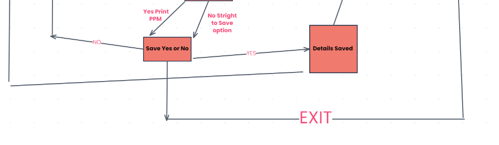
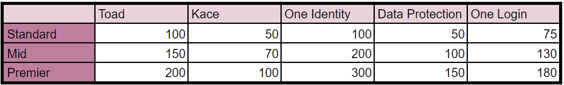

# Table of Contents

- [Purpose](#purpose)
    - [Target Audience](#target-audience)
- [User-Stories](#user-stories)
    - [First-Time-Visitor-Goals](#first-time-visitor-goals)
    - [Returning-Visitor-Goals](#returning-visitor-goals)
    - [Frequent-Visitor-Goals](#frequent-visitor-goals)
    - [Owner-Goals](#owner-goals)
- [Design](#design)
    - [Colour-Scheme](#colour-scheme)
    - [Logo](#logo)
    - [Typography](#typography)
    - [Imagery](#imagery)
- [Flow-Chart](#flow-chart)
- [Features](#features)
    - [Existing-Features](#existing-features)
    - [Features-left-to-Implement](#features-left-to-implement)
- [Testing](#testing)
    - [Manual-Testing](#manual-testing)
    - [Issues-and-Resolutions](#issues-and-resolutions-found-during-testing)
    - [Lighthouse](#lighthouse-testing)
    - [Validator-Testing](#validator-testing)
- [Deployment](#deployment)
- [Credits](#credits)
    - [Content](#content)
    - [Media](#media)
    - [Code](#code)
    - [Technologies](#technologies)
- [Acknowledgements](#acknowledgements)
- [Disclaimer](#disclaimer)

# Sales Calculator

### Purpose
The purpose of this site is to provide the user with pricing for their renewal quotes. It has specifically created for renewal representitives who work for Quest Software. They input some details, the price, level and product and the system will provide them with the new pricing for this years quote. They can also choose to get the pricing for a 2 year and 3 year quote so they can easily provide all options to the customer.
This program also stores the customer data so that the user can access previous quote prices for their reference. 
The purpose of this site is to streamline the renewal process for these sales representitives. Many of thier quotes need to be manually priced so this site can help them to work out the pricing of a quote in a more efficient way.

# Target Audience
The Target Audience for this website is sales reps specifically the sales reps who work for my current employer Quest software. These reps have a number of manual calculatitons that needs to be done to prepare a quote for their customer, this has to be done for thousands of quotes every three months. Part of my role in the past was to price these quotes for the reps. There is a definate need here for something that makes the process easier and more streamlined. This app is designed to take away some of this manual work so that the sales rep can concentrate on selling the products to the customer rather than focusing so much time on administration work.
This is the sort of functionality that many CRM systems implement to streamline quoting for customers. 

# User Stories
### First Time Visitor Goals
As a first time visitor I want to be able to choose what product I am working with and the support level so I can get an accurate calculation for my renewal quote. 
I also wants to be able to get the price for a 2 or 3 year renewal so I can present the three options to my customer.
I want to be able to input the customer name and spcific data of this quote and have it stored by the system in a google sheet so I can access this data again at a later stage. 
As a first time visitor (Or Returning/ Frequent) I want the program to be simple and easy to use. 
As a first time visitor (Or Returning/ Frequent) I want the system to work even if I input the wrong type of data.

### Returning Visitor Goals
A returning visitor wants to be able to use the app to price a quote just as the first time visitor. But this user also wants to be able to access previous quote data for users so they can see a list of previous priced quotes for this customer.

### Frequent Visitor Goals
A frequent Visitor wants to be able to price new quotes and also get previous pricing for a specific customer if there is any.

# Owner Goals
- As the owner, I want to provide a program that fulfils the users’ needs.
- As the owner, I want to make it immediately obvious what the program is for.
- As the owner, I want to provide clear and accurate information.
- As the owner, I want to create an experience that is pleasant for users.
- As the owner, I want the program to continue without crashing due to an error caused by user input.

# Design

### Colour scheme

As this is a terminal based application the level of detail for colour in this page are not that detailed. 
I have imported colours from the Python library colorama and used the colours consistently throughout the program.
Green - All input messages are green to make then stand out
Yellow - confirmation messages to the user are yellow

### Imagery

I have used an image of a calculator, it is just a simple image but draws the users eye and helps their understanding of the purpose  of the site.

# Flow Charts

# Features 

## Existing Features

### Into Page
When the program loads the user is Greated with text welcoming them to the Renewal Calculator and an image of a calculator. There is a description of what the program does. It then gives the user two options they can either choose to start a new calculation or they can get access to historical data for their customer. 
They are then prompted to enter which option they would like to go for by inputting 1 for new calculation or 2 for historical data.

### New Calculation
If the user selects to start a new calculation they are then prompted to enter their customer's name. There is a message outlining the format the customer name must take. If the customer name fits the convention then a message is printed telling the user that the customer name is accepted. If the user enters a format that is not accepted they will recieve and error message telling them the name they have entered is not valid and they will be prompted to re-enter the user name. 

### Product Select
Once the user has entered a customer name that is accepted by the system they will then be prompted to select the product their quote is for, either Toad or Kace. 
If the enter anything other than Toad or Kace they will get an error stating Invalid input and they will be prompted to try again. 

### Level Select
 Once they have entered the amount the user is then asked to select the level of support on the quote, is it standard, mid or premier. The product type and support level determine the pricing that is applied to the quote.

### Enter Amount
The user is then prompted to enter the amount for last years renewal quote.

### Print Calculation
The program then checks the price the user has entered against a price book I have created in a google sheet. 

 If the price is below what is in the google sheet an uplift is applied but if the user has entered a price that matches or is above the price that is in the price book the system will inform them that the  calculation can not be done as their quote had already reached list  price. 
 If the price is below the list price then the applicable uplift will be applied and the price will be printed.

### PPM Calculation 

### Save 

### Access stored data

### Features Left to Implement
Currency converter. I hope in future to implement a currency converter as part of this renewal calculator.

# Testing 

## Manual Testing

## Issues and Resolutions found during testing

## Lighthouse Testing

## Deployment

### Content 

- All text used throughout the site was written by me.
- All the business information was created by me.

### Media
- https://realpython.com/python-exceptions/ (Reference for exception handling)
- https://peps.python.org/pep-0008/
- https://github.com/Textualize/rich

### Technologies
- https://www.asciiart.eu/electronics/calculators (I got the image of a calculator from this site)
- google sheets
- excel 
- pandas (Data manipulation)
- Colorama https://pypi.org/project/colorama/  (Api for adding colour to text)
- Rich api (Style for text)

# Acknowledgements

## Disclaimer
This website is for educational use only.

